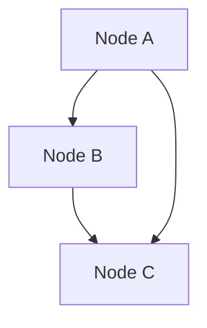

At the most basic level, a Mermaid diagram consists of nodes and links. Nodes represent entities in the diagram, while links represent the relationships between these entities. The following code demonstrates how to create simple nodes and links:

```markdown
flowchart TD
A[Node A] --> B[Node B]
B --> C[Node C]
A --> C
```

Depending on the context in which this code is placed (for example, an HTML file or a Markdown file), you may need to wrap it in additional markup for it to render correctly. This code produces the following diagram:



`flowchart TD` declares a flowchart and sets the layout direction to top-down.

The line `A[Node A] --> B[Node B]` creates a node named "Node A" and a node named "Node B", and then creates a link between them. The first time a node is referenced, we specify an identifier for it (in this case, `A` and `B`) followed by the label for the node in square brackets. The identifier is used internally to reference the node, while the label is the text displayed in the diagram. The formatting of each node is determined by the characters around the node label. In this case, the square brackets around each node cause them to be displayed as rectangles.

In the example above, the links between the nodes are specified by the `-->` syntax. This defines a directed link from the node on the left of the link to the node on the right.

In the second line `B --> C[Node C]`, when referencing the node we labelled `B`, we only need to use its identifier to relate it to the new node `C`, which we fully specify. In the third line `A --> C`, we reference both nodes by their identifiers.
